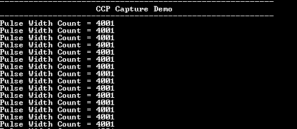

# CCP Capture Mode

This example shows how to use the CCP module in capture mode to measure pulse width of an input signal.

## Description

In this application, a pulse signal is generated using the compare mode of CCP peripheral and is fed to the capture input. CCP peripheral captures the time at every edge and displays the pulse width on the serial terminal.

## Downloading and building the application

To clone or download this application from Github, go to the [main page of this repository](https://github.com/Microchip-MPLAB-Harmony/csp_apps_pic32mm) and then click **Clone** button to clone this repository or download as zip file.
This content can also be downloaded using content manager by following these [instructions](https://github.com/Microchip-MPLAB-Harmony/contentmanager/wiki).

Path of the application within the repository is **apps/ccp/ccp_capture_mode/firmware** .

To build the application, refer to the following table and open the project using its IDE.

| Project Name      | Description                                    |
| ----------------- | ---------------------------------------------- |
| pic32mm_usb_curiosity.X | MPLABX project for [PIC32MM USB Curiosity board](https://www.microchip.com/DevelopmentTools/ProductDetails/DM320107) |
|||

## Setting up the hardware

The following table shows the target hardware for the application projects.

| Project Name| Board|
|:---------|:---------:|
| pic32mm_usb_curiosity.X | [PIC32MM USB Curiosity board](https://www.microchip.com/DevelopmentTools/ProductDetails/DM320107) |
|||

### Setting up [PIC32MM USB Curiosity board](https://www.microchip.com/DevelopmentTools/ProductDetails/DM320107)
- To run the demo, the following additional hardware are required:
  - [USB UART click board](https://www.mikroe.com/usb-uart-click)

- Connect micro USB cable to the 'USB1' connector on the board to the computer
- Install an [USB UART click board](https://www.mikroe.com/usb-uart-click) on to the mikroBUS socket J4
- Connect the OCM2C pin RB0 (Pin on J12) to the ICM1 pin RA10 (pin on J12)
- Connect mini USB cable between PC and the [USB UART click board](https://www.mikroe.com/usb-uart-click)

## Running the Application

1. Open the Terminal application (Ex.:Tera term) on the computer
2. Connect to the "USB to UART" COM port and configure the serial settings as follows:
    - Baud : 115200
    - Data : 8 Bits
    - Parity : None
    - Stop : 1 Bit
    - Flow Control : None
3. Build and Program the application project using its IDE
4. Console displays the captured pulse width as shown below:

    
